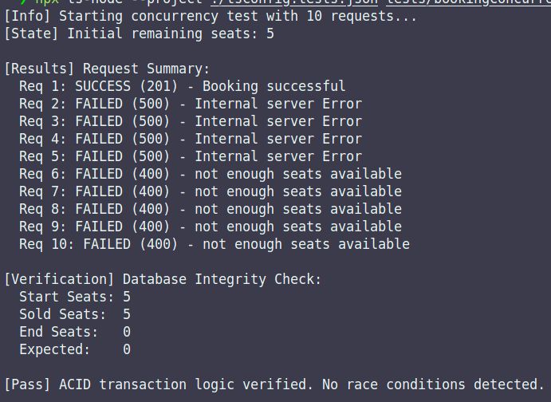

# Ticket Booking System API

## Overview

This is a backend REST API designed to handle high-concurrency ticket booking operations. The system implements ACID transactions to prevent race conditions (overselling) and utilizes idempotency keys to ensure transaction safety during network failures or duplicate requests.

## Architecture

- **Runtime:** Node.js (TypeScript)
- **Database:** MongoDB (Replica Set Configuration)
- **Containerization:** Docker & Docker Compose

### Why Docker Compose?

This project requires a MongoDB Replica Set (`rs0`) to support multi-document transactions (ACID). Standard local MongoDB installations often run as standalone instances, which do not support transaction sessions.

We utilize Docker Compose to orchestrate three services:

1. **mongo:** The database container running with the `--replSet` flag.
2. **mongo-init:** A transient sidecar container that waits for the database to be healthy and automatically initializes the replica set.
3. **api:** The Node.js application.

Using `npm run build` and `npm run start` locally without this Docker configuration will result in transaction errors unless a local replica set is manually configured.

## Prerequisites

- Docker Desktop or Docker Engine + Docker Compose installed and running.
- Node.js (LTS) and npm (for local test scripts).

## Installation & Configuration

### 1. Clone the Repository

```
git clone https://github.com/aditya9-2/ticket-booking.git
cd ticket-booking
```
## 2. Environment Configuration

Create a `.env` file in the root directory:
```bash
PORT=3000
# Internal Docker URI for the container
MONGO_URI=mongodb://mongo:27017/ticket-booking?replicaSet=rs0
# JWT Secret for authentication
JWT_TOKEN=your_secure_secret_key_here
```

## Deployment

Build and start the system using Docker Compose:
```
docker compose up -d --build
```

Wait approximately 10–15 seconds for the mongo-init service to complete the replica set initialization. Verify running containers with:
```
docker ps
```

***Note:*** This Docker setup handles both API and MongoDB replica set initialization. Running npm run build locally without this configuration may lead to transaction errors due to lack of replica set support.


## API Usage Guide
1. User Registration (Signup)
```
curl -X POST http://localhost:3000/v1/auth/signup \
-H "Content-Type: application/json" \
-d '{
    "name": "user",
    "email": "user@user.com",
    "password": "123123"
}'
```

By default, users are created with `roleId = 2` (regular user).
To create an Admin, include `"roleId": 1` in the request body.


## 2. User Authentication (Signin)
```
curl -X POST http://localhost:3000/v1/auth/signin \
-H "Content-Type: application/json" \
-d '{
    "email": "user@user.com",
    "password": "123123"
}'

```
The response contains a JWT token:
```
{
    "token": "your_jwt_token_here"
}
```

Save this token for authenticated requests.

 ## 3. Create Event (Admin Only)
```
curl -X POST http://localhost:3000/v1/admin/create-event \
-H "Authorization: Bearer $TOKEN" \
-H "Content-Type: application/json" \
-d '{
    "name": "Global Tech Summit 2026",
    "sections": [
        {
            "name": "VIP",
            "price": 100,
            "capacity": 20,
            "remaining": 20
        },
        {
            "name": "General",
            "price": 50,
            "capacity": 100,
            "remaining": 100
        }
    ]
}'
```
Replace $TOKEN with the JWT obtained from the Admin signin response.

## 4. Booking Tickets (User)
```
curl -X POST http://localhost:3000/v1/tickets/book \
-H "Authorization: Bearer $TOKEN" \
-H "Content-Type: application/json" \
-d '{
    "eventId": "event_id_here",
    "sectionId": "section_id_here",
    "quantity": 2,
    "idempotencyKey": "unique_key_123"
}'

```
`idempotencyKey` ensures that repeated requests due to network issues or retries do not result in duplicate bookings.


## 5. Retrieve Events
```
curl -X GET http://localhost:3000/v1/event/all
-H "Authorization: Bearer $TOKEN"
```

This endpoint returns a list of all events, including their sections and prices.

## 6. Retrieve Single Event
```
curl -X GET http://localhost:3000/v1/event/<event_id>
-H "Authorization: Bearer $TOKEN"
```

Replace `<event_id>` with the actual event ID. This returns detailed information for a single event.


## 7. Retrieve All Bookings (Admin Only)
```
curl -X GET http://localhost:3000/v1/admin/all-bookings
-H "Authorization: Bearer $TOKEN"
```

This endpoint returns all bookings in the system, including user information and the event details. Only accessible by Admin users.


## 8. Update Event (Admin Only)
```
curl -X PUT http://localhost:3000/v1/admin/update-event/<event_id> \
  -H "Authorization: Bearer $TOKEN" \
  -H "Content-Type: application/json" \
  -d '{
    "name": "Updated Event Name",
    "sections": [
      {
        "name": "VIP",
        "price": 120,
        "capacity": 25,
        "remaining": 25
      }
    ]
  }'
```


## 9. Delete Event (Admin Only)
```
curl -X DELETE http://localhost:3000/v1/admin/delete-event/<event_id>
-H "Authorization: Bearer $TOKEN"
```
This deletes the event and archives the original data. Only Admins can perform this action.

## 10. Concurrency & Stress Test for Ticket Booking

This project includes a TypeScript test script to validate high-concurrency bookings and ensure ACID transactions prevent overselling.

### Test Script Configuration

Edit `tests/bookingConcurrencyTest.ts` to set your test parameters:

```ts
const CONFIG = {
    BASE_URL: "http://localhost:3000/v1",
    TOKEN: "your_jwt_token_here",
    EVENT_ID: "your_event_id_here",
    SECTION_ID: "your_section_id_here",
    TOTAL_REQUESTS: 10,
    QTY_PER_REQUEST: 5
};
```
`TOTAL_REQUESTS:` Number of concurrent booking requests.

`QTY_PER_REQUEST:` Number of tickets to book per request.

`TOKEN,` `EVENT_ID, `SECTION_ID:` Replace with actual values.

## Run the Concurrency Test

```
npx ts-node --project ./tsconfig.tests.json tests/bookingConcurrencyTest.ts

```


## Expected Output

The script will output:

1. Initial remaining seats.

2. Request results for each booking attempt (SUCCESS or FAILED).

3. Final remaining seats and verification against expected value.

4. Pass/Fail status for ACID transaction integrity.

### Sample output:

```yaml
[Info] Starting concurrency test with 10 requests...
[State] Initial remaining seats: 50

[Results] Request Summary:
  Req 1: SUCCESS (201) - Booking successful
  Req 2: SUCCESS (201) - Booking successful
  Req 3: FAILED (400) - not enough seats available
  ...

[Verification] Database Integrity Check:
  Start Seats: 50
  Sold Seats:  20
  End Seats:   30
  Expected:    30

[Pass] ACID transaction logic verified. No race conditions detected.

```

This ensures that multiple users booking tickets simultaneously will not oversell any section.

### ***Notes***

- All authenticated endpoints require the `Authorization: Bearer $TOKEN` header.

- Always use unique `idempotencyKey` values for ticket bookings to prevent duplicate processing.

- **Docker Compose initializes both the API and MongoDB replica set automatically. Avoid manual DB setup unless necessary.**

- The provided concurrency test validates that your booking system maintains transactional integrity under load.

## Screenshot

After running the stress/concurrency test, capture the terminal output showing bookings and remaining seats to include in documentation or for verification purposes.

