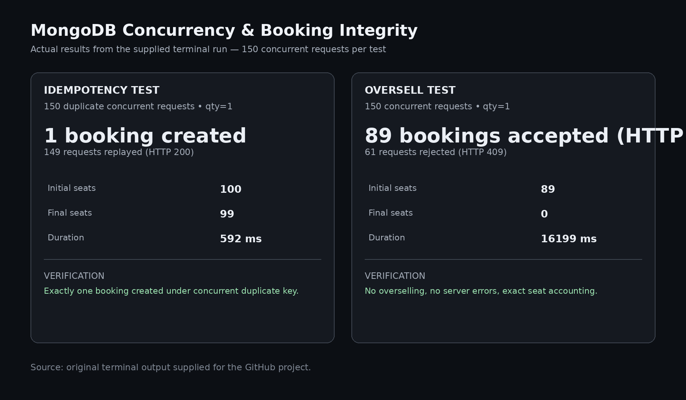

# Ticket Booking System API

A backend REST API for a ticket-booking system designed to handle concurrent booking requests safely. The system uses **MongoDB transactions, atomic updates, and idempotency keys** to maintain booking consistency and prevent ticket overselling during concurrent requests and network retries.

## Overview

### Key Features

* RESTful API built with Node.js and TypeScript
* JWT-based authentication and role-based authorization
* MongoDB transactions (`session.withTransaction()`) with automatic retry on write conflicts, using a replica set
* Atomic ticket inventory updates — correctly returns `409 Conflict` (not `500`) when seats are unavailable
* Idempotent booking requests using idempotency keys, enforced via a unique index with `E11000` duplicate-key handling
* Admin event management
* Booking history and retrieval APIs
* Dockerized development environment (3-container Compose stack: `mongo`, `mongo-init`, `api`)
* Concurrent booking stress test to verify transaction integrity, with measured results below
* CI pipeline (GitHub Actions) for automated build and image publishing

## Architecture

* **Runtime:** Node.js + TypeScript
* **Database:** MongoDB with Replica Set (`rs0`)
* **Authentication:** JWT
* **Containerization:** Docker + Docker Compose

### Why MongoDB Replica Set?

MongoDB multi-document transactions require a replica set or sharded cluster. Therefore, this project runs MongoDB as a single-node replica set (`rs0`) through Docker Compose.

Docker Compose orchestrates three services:

1. **mongo** — MongoDB instance started with replica-set support.
2. **mongo-init** — Initializes the `rs0` replica set after MongoDB becomes available.
3. **api** — Node.js/TypeScript REST API.

This allows the booking workflow to use MongoDB transactions locally without requiring a manually configured MongoDB replica set.

A cold start of the full stack (`docker compose down -v` → all containers healthy via `docker compose up -d --wait`) takes **~7.5s**.

## Prerequisites

* Docker Engine/Desktop
* Docker Compose
* Node.js LTS and npm (required for local scripts)

## Installation & Configuration

### 1. Clone the Repository

```bash
git clone https://github.com/aditya9-2/ticket-booking.git
cd ticket-booking
```

### 2. Environment Configuration

Create a `.env` file in the project root:

```env
PORT=3000
MONGO_URI=mongodb://mongo:27017/ticket-booking?replicaSet=rs0
JWT_TOKEN=your_secure_secret_key_here
```

> The MongoDB hostname `mongo` is resolved through the Docker Compose network.

## Run Locally with Docker Compose

Start the API and MongoDB replica set:

```bash
docker compose up -d --build
```

Verify that the containers are running:

```bash
docker ps
```

The `mongo-init` service initializes the MongoDB replica set automatically.

> Running the API directly with `npm run build` / `npm run start` requires a MongoDB instance configured as a replica set. Otherwise, transaction-based booking operations will fail.

# API Usage

All authenticated endpoints require:

```http
Authorization: Bearer <JWT_TOKEN>
```

## 1. User Registration

```bash
curl -X POST http://localhost:3000/v1/auth/signup \
-H "Content-Type: application/json" \
-d '{
    "name": "user",
    "email": "user@user.com",
    "password": "123123"
}'
```

New users are assigned the default user role.

> Administrative users should be provisioned through a controlled administrative mechanism rather than allowing arbitrary role assignment through public registration.

## 2. User Authentication

```bash
curl -X POST http://localhost:3000/v1/auth/signin \
-H "Content-Type: application/json" \
-d '{
    "email": "user@user.com",
    "password": "123123"
}'
```

The response contains a JWT:

```json
{
    "token": "your_jwt_token_here"
}
```

Save the token for subsequent authenticated requests.

## 3. Create Event — Admin Only

```bash
curl -X POST http://localhost:3000/v1/admin/create-event \
-H "Authorization: Bearer $TOKEN" \
-H "Content-Type: application/json" \
-d '{
    "name": "Global Tech Summit 2026",
    "sections": [
        {
            "name": "VIP",
            "price": 100,
            "capacity": 20,
            "remaining": 20
        },
        {
            "name": "General",
            "price": 50,
            "capacity": 100,
            "remaining": 100
        }
    ]
}'
```

Replace `$TOKEN` with a JWT belonging to an authorized administrator.

## 4. Book Tickets

```bash
curl -X POST http://localhost:3000/v1/tickets/book \
-H "Authorization: Bearer $TOKEN" \
-H "Content-Type: application/json" \
-d '{
    "eventId": "event_id_here",
    "sectionId": "section_id_here",
    "quantity": 2,
    "idempotencyKey": "unique_key_123"
}'
```

The `idempotencyKey` allows clients to safely retry a booking request without unintentionally creating duplicate bookings. Retrying with the same key returns the original booking response (`200`) instead of creating a second one.

## 5. Retrieve All Events

```bash
curl -X GET http://localhost:3000/v1/event/all \
-H "Authorization: Bearer $TOKEN"
```

Returns available events along with their sections and pricing information.

## 6. Retrieve a Single Event

```bash
curl -X GET http://localhost:3000/v1/event/<event_id> \
-H "Authorization: Bearer $TOKEN"
```

Returns details for the specified event.

## 7. Retrieve All Bookings — Admin Only

```bash
curl -X GET http://localhost:3000/v1/admin/all-bookings \
-H "Authorization: Bearer $TOKEN"
```

Returns booking information available to authorized administrators.

## 8. Update Event — Admin Only

```bash
curl -X PUT http://localhost:3000/v1/admin/update-event/<event_id> \
-H "Authorization: Bearer $TOKEN" \
-H "Content-Type: application/json" \
-d '{
    "name": "Updated Event Name",
    "sections": [
        {
            "name": "VIP",
            "price": 120,
            "capacity": 25,
            "remaining": 25
        }
    ]
}'
```

## 9. Delete Event — Admin Only

```bash
curl -X DELETE http://localhost:3000/v1/admin/delete-event/<event_id> \
-H "Authorization: Bearer $TOKEN"
```

Deletes the event and archives the original data.

# Concurrency & Stress Testing

The project includes a TypeScript-based concurrency test (`tests/bookingConcurrencyTest.ts`, compiled with `tsc`, target ES2022 / NodeNext modules) to validate booking behavior when multiple requests attempt to reserve tickets simultaneously. A single `CONFIG` block controls the mode, target event/section, and request count.

### Test Configuration

```ts
const CONFIG = {
    BASE_URL: "http://localhost:3000/v1",
    TOKEN: "your_jwt_token_here",
    EVENT_ID: "your_event_id_here",
    SECTION_ID: "your_section_id_here",
    TOTAL_REQUESTS: 10,
    QTY_PER_REQUEST: 5
};
```

* `TOTAL_REQUESTS` — Number of concurrent booking requests.
* `QTY_PER_REQUEST` — Number of tickets requested per request.
* `TOKEN` — Authentication token.
* `EVENT_ID` — Target event.
* `SECTION_ID` — Target ticket section.

### Run the Test

```bash
npm run test:concurrency
```

### What the Test Verifies

The test reports:

1. Initial ticket availability.
2. Result of each concurrent booking request.
3. Final remaining ticket count.
4. Expected versus actual inventory.
5. Transaction integrity status.

When demand exceeds available inventory, only requests that can be fulfilled should succeed, while unsuccessful transactions should leave the ticket inventory consistent.

### Measured Results

**Overselling test** — 150 concurrent requests (qty 1 each) against a section with 89 remaining seats:

```text
Booked (201):    89
Rejected (409):  61
Server errors:   0
End seats:       0   (exact match to expected)
Duration:        16,199ms (~16.2s)
```

**Idempotency test** — 150 concurrent requests using one identical idempotency key, against a section with 100 remaining seats:

```text
Booked (201):              1
Already-processed (200):   149
Server errors:              0
End seats:                  99  (exact match to expected)
Duration:                   592ms
```

Both runs completed with **zero server errors** — the original controller (before the transaction/retry fix) returned `500` on 8 of 10 requests under the same conditions.

## Concurrency Test Screenshot

The following screenshot shows the output of the concurrent booking test, including booking results and the final inventory verification.



## Continuous Integration

A GitHub Actions workflow (`build-and-test`) runs on push: checkout → `npm install` → `npm run build` → Docker login → Docker build → Docker push. Total job runtime is **~37s**. This is currently a build/publish pipeline — it does not yet run the concurrency test suite as a merge gate.

## Notes

* Authenticated endpoints require a valid JWT.
* Use a unique `idempotencyKey` for each logical booking operation.
* Docker Compose automatically configures the MongoDB replica set required by transaction-based booking operations.
* The concurrency test can be used to validate booking consistency under simultaneous requests; see measured results above.
* The JWT test token is currently hardcoded in `tests/bookingConcurrencyTest.ts` rather than pulled from an env var — fine for local stress testing, but swap it out before using the script anywhere shared.